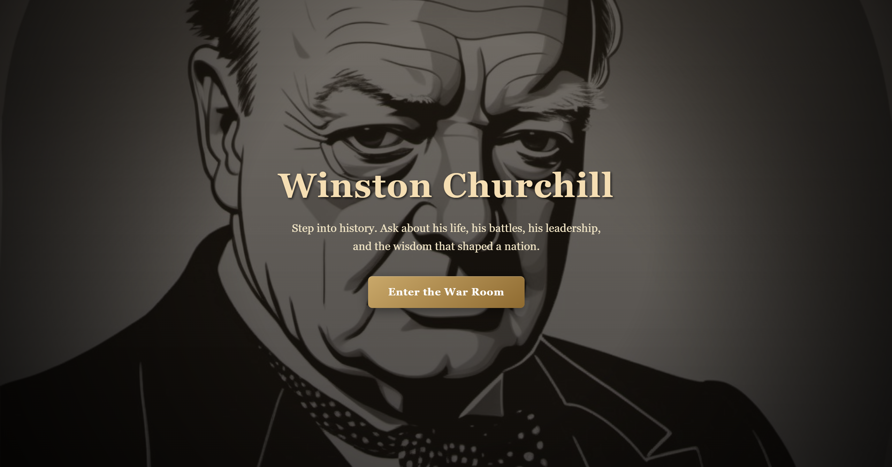
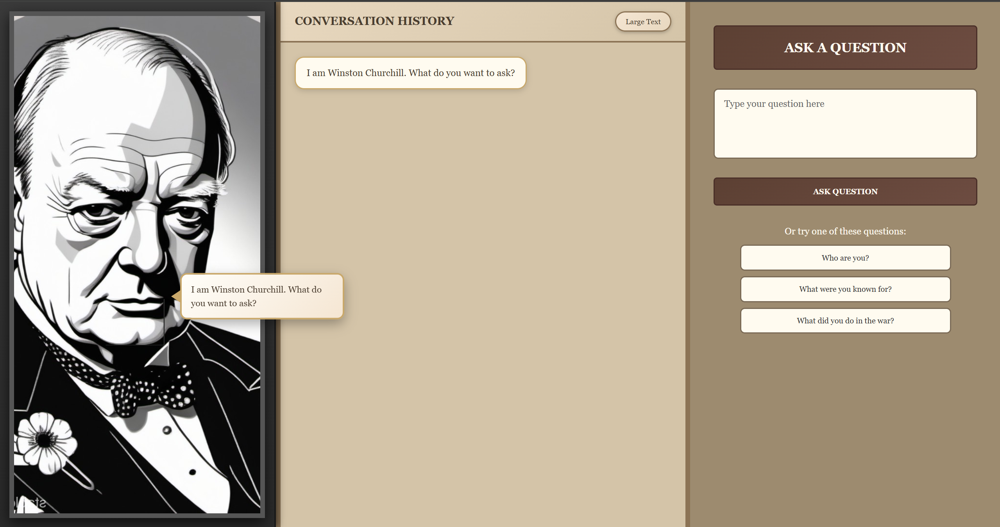

# Winston Churchill AI Chatbot 🇬🇧

An intelligent hybrid chatbot that simulates Winston Churchill using rule-based scripting and LLM fallback.

## 🚀 Features

- 🧠 Hybrid AI (Scripted + LLM fallback)
- 💬 Context-aware conversation memory
- 🎭 Strong character enforcement (Churchill persona)
- ⚡ Fast responses with deterministic + AI routing
- 🧩 Dialogue tree system for structured conversations

## 🏗️ Architecture

User Input  
→ Script Matching (fast responses)  
→ If no match → LLM Fallback  
→ Response returned with memory context  

## 🛠️ Tech Stack

- Frontend: React (Vite)
- Backend: Node.js + Express
- AI: HuggingFace Inference API
- Styling: CSS


## 📸 Demo

### Home Page


### Chat Interface


## ⚙️ Setup

### 1. Clone repo
```bash
git clone https://github.com/Yash00746/churchill-chatbot.git


